# Resume Manager Web Application

This is a WIP version of the Resume Manager for Delhi Technological University developed using the PHP framework CodeIgniter.
Development of this project started in Dec 2016 and active usage started from July 2017.   
This is a portal which will be used by over 5000 students on a daily basis to apply for campus placements. It will also be used by more than 300 recruiters to post job openings. There is also an admin panel which can be used for monitoring by the college authorities and placement coordinators.

**Tools/Languages/Libraries Used:**  
- Backend: PHP, CodeIgniter
- Database: MySQL
- Frontend: JavaScript, jQuery, AJAX, AdminLTE Bootstrap CSS Template

****************

 <b> Screenshots from the Application: </b>

****************
**Student Portal**

  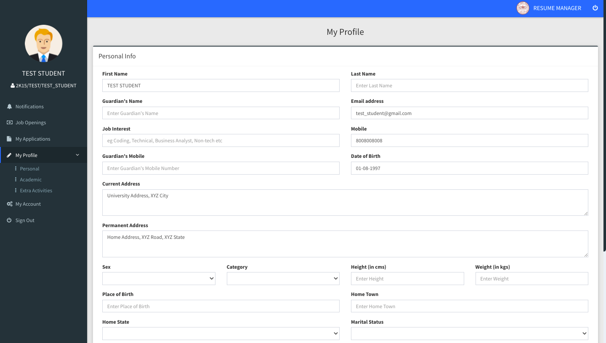
&nbsp; &nbsp; &nbsp; &nbsp;
  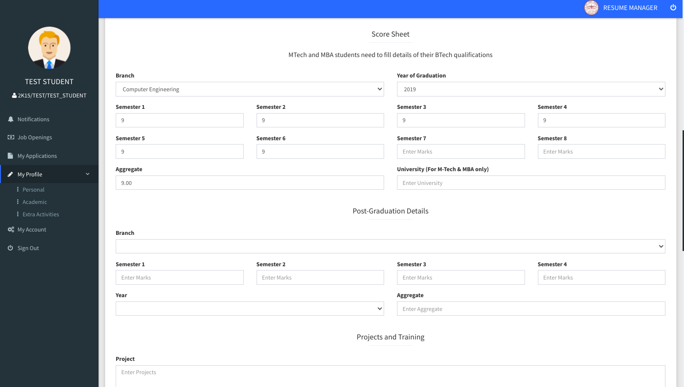

  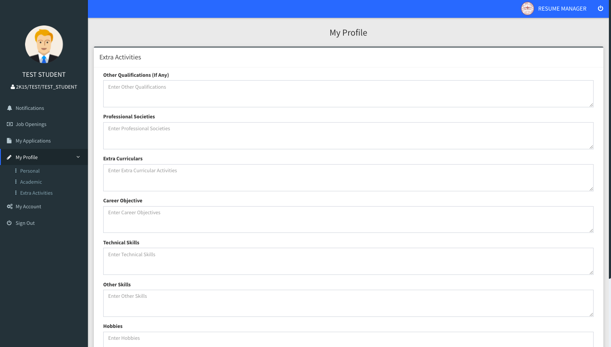
&nbsp; &nbsp; &nbsp; &nbsp;
  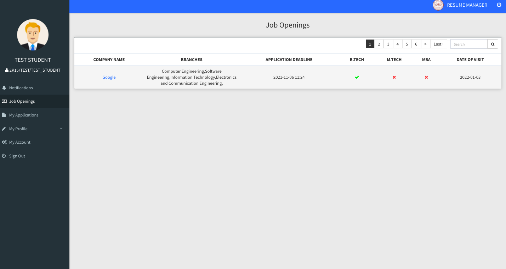

  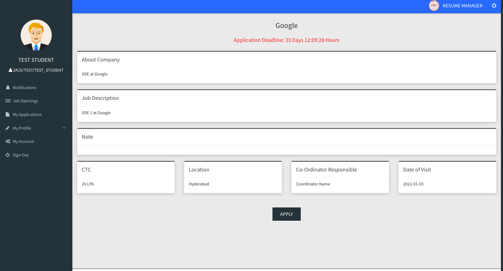
&nbsp; &nbsp; &nbsp; &nbsp;
  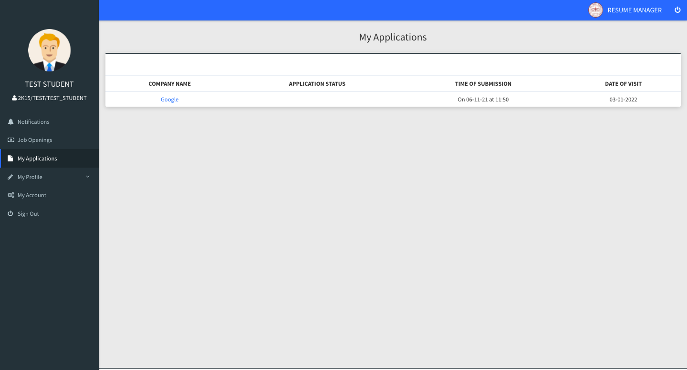

  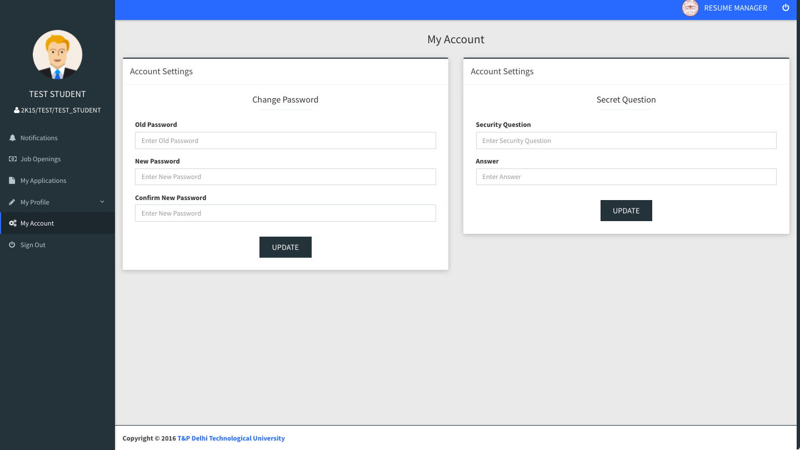
&nbsp; &nbsp; &nbsp; &nbsp;
  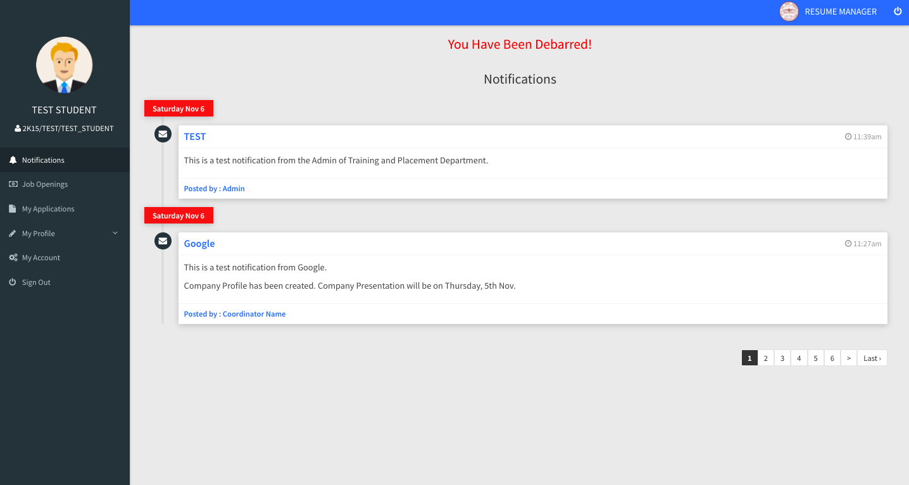

****************
**Recruiter Portal**

  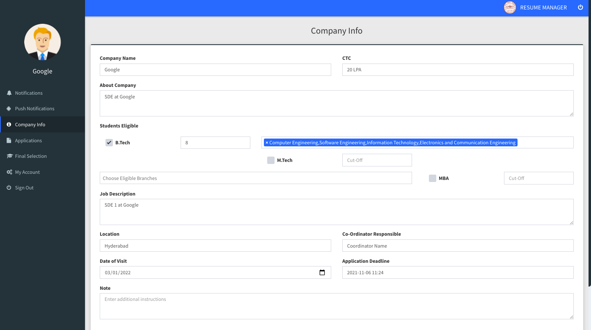
&nbsp; &nbsp; &nbsp; &nbsp;
  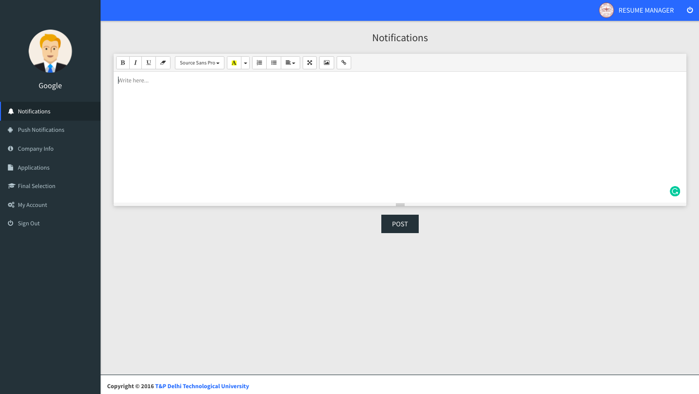

  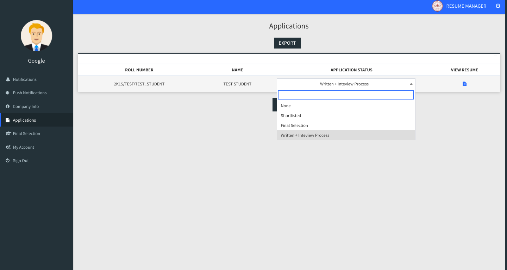
&nbsp; &nbsp; &nbsp; &nbsp;

****************
**Admin Portal**

  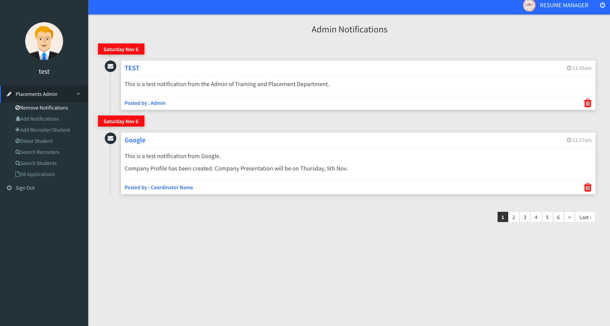
&nbsp; &nbsp; &nbsp; &nbsp;
  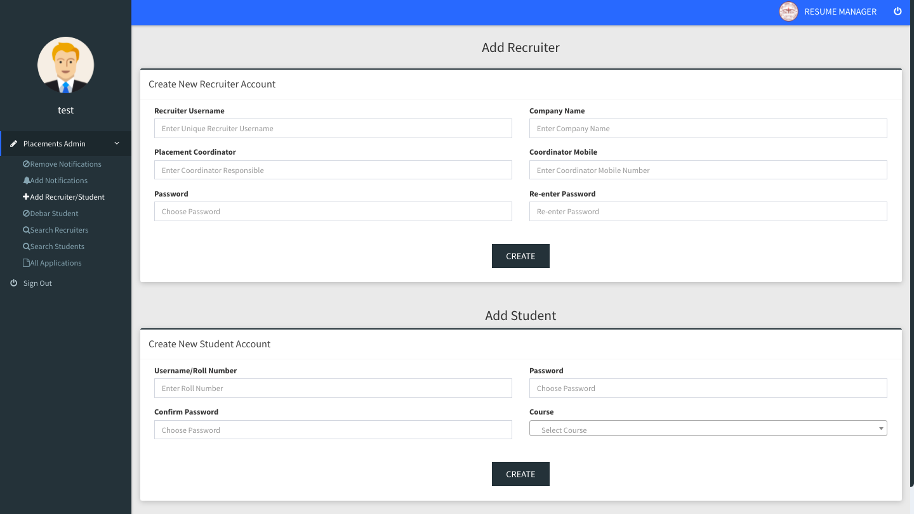

  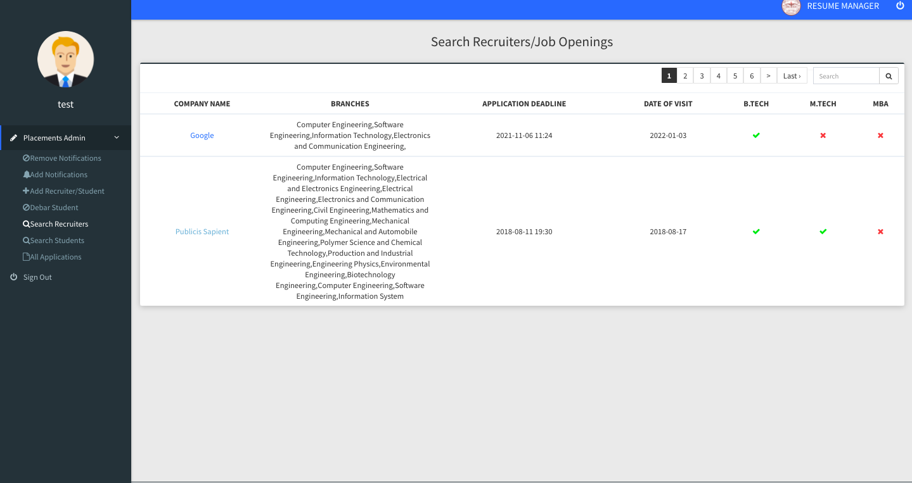
&nbsp; &nbsp; &nbsp; &nbsp;
  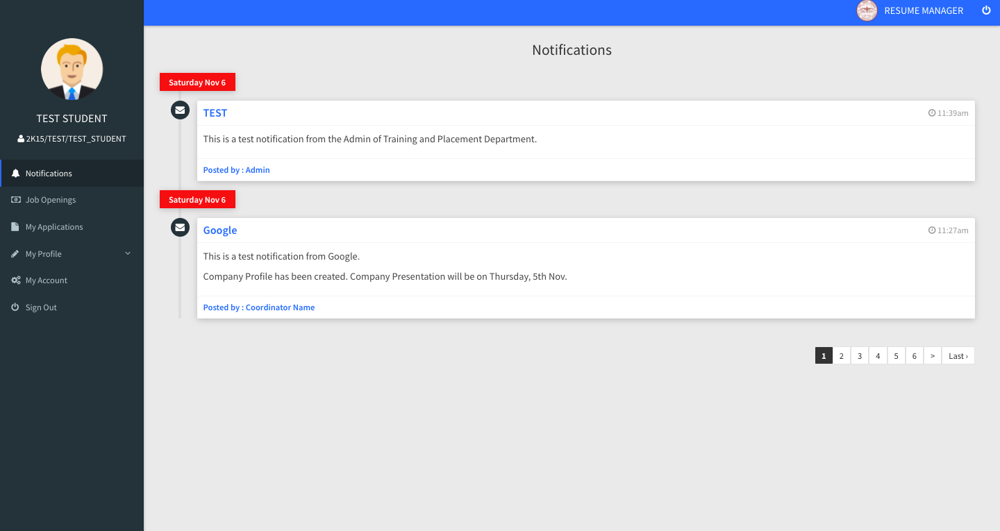

  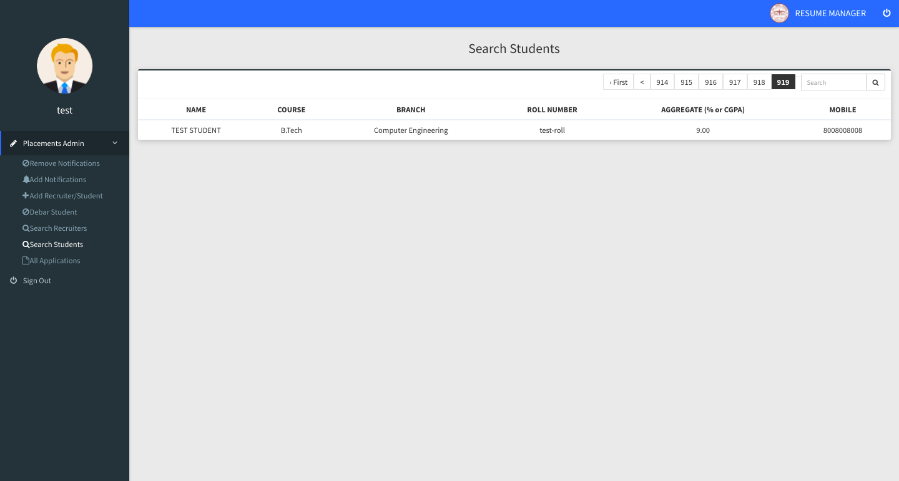
&nbsp; &nbsp; &nbsp; &nbsp;
  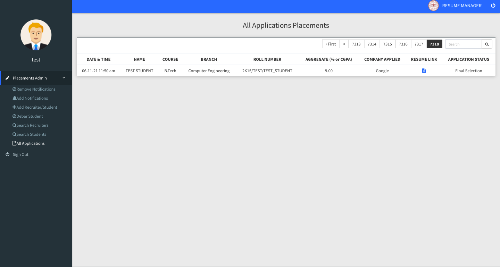

